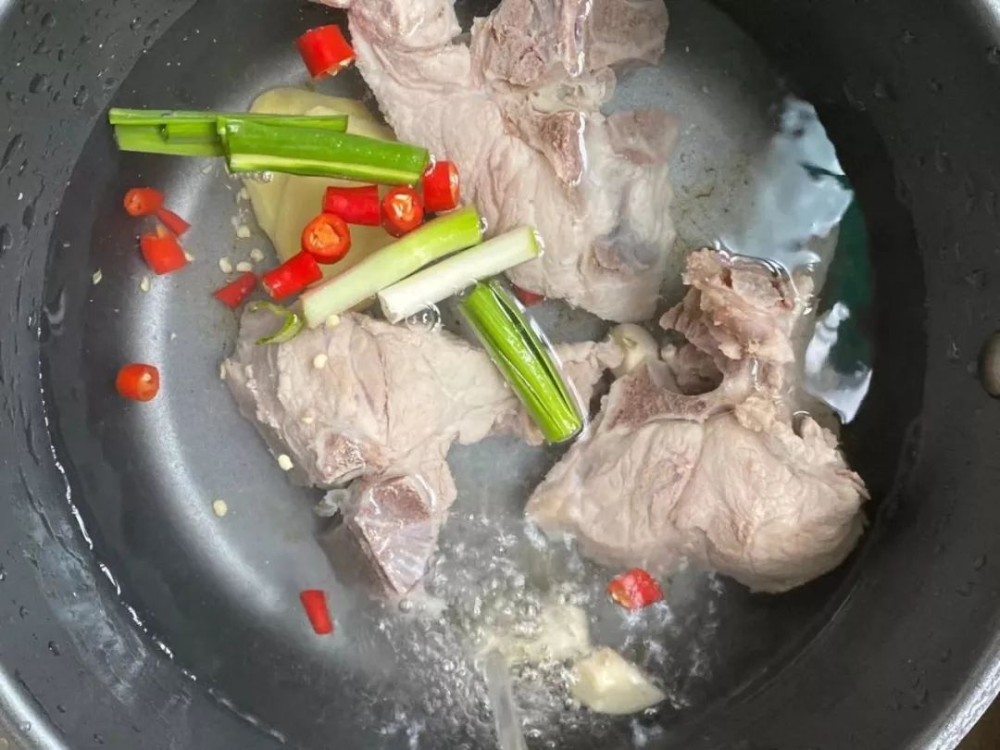

> 原文地址：[自我隔离的第 1 天](https://mp.weixin.qq.com/s/LAq-ybXJYUf6p8ZYnoosQg)

---

## 自我隔离的第一天

大年初一，手机关机掉，格外安静。**刚才全副武装出了趟门，发现老爷爷老奶奶基本没有任何防护措施。**考虑到新型冠状肺炎的发展情况，我们应当选择将自己与人群隔离开来，既是保护自己，也是保护他人。

尤其是刚刚从车站、机场等人群密集区域回家的人，更加需要注意。

我情况比较特殊，父母目前处于疫情严管区，无法归来，一切生活事项均需要自己处理。昨晚到家后看了下，目前拥有的物资如下：

- 一冰箱的肉；
- 一袋白菜；
- 半袋米，最爱白米饭 🍚；
- 零食和口罩若干；
- 各种电器均可正常使用。

生活上都是可以保障的，最长可持续时间预估为一周。想当初玩《瘟疫公司》，这回要来现实演绎一把，真不是滋味呢！

为什么要放辣椒？😱

春节的计划已经全部打乱，只能重新规划。家里蹲着吧，陪陪家人或者享受孤独，不光是今年，也应该是平日里最大的美德。在这一点上，我还是非常有生活经验的。基本安排如下：

1、刷完 Netflix 的新剧《彼岸之嫁》；

**2、维护好[「nCoV 相关资讯实时播报」](https://t.me/nCoV2019)微信群组；**
3、记录每日生活并成文，毕竟这样事情很难体验，也是人类有限生活的一部分；
4、写好日本旅行的攻略；
5、组队打打「王者荣耀」；
6、读完本周选书《十日谈》

> 概要：1348 年繁華的佛羅倫萨發生一場殘酷的瘟疫（黑死病），喪鐘亂鳴，死了十多萬人，在整個歐洲，因此病而死的人多達一千萬人。隔年薄伽丘以這次瘟疫為背景，執筆寫下了《十日談》，內容是講述七位女性和三位男性到佛羅倫斯郊外山上的別墅躲避瘟疫，這十位男女就在賞心悅目的園林裏住了下來，除了唱歌跳舞之外，大家決定每人每天講一個故事來渡過酷熱的日子，最後合計講了一百個故事，即《十日談》的內容。

总的来说，还是祝大家新春快乐，健康幸福，希望大家不要恐慌，先把事实摸清楚，再来做决策和判断，然后找到解决方案。