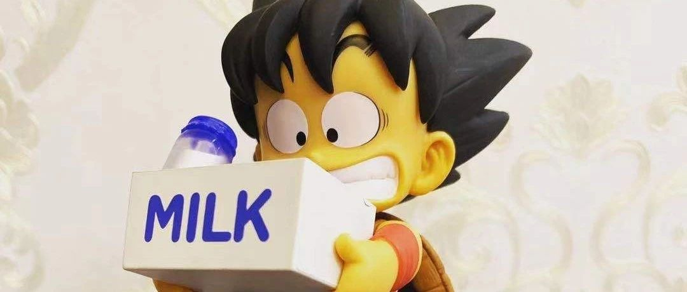

> 原文地址：[自我隔离的第二天](https://mp.weixin.qq.com/s/lL_SHESgBdSNVDlCBBWf4A)

## 自我隔离的第二天

大年初二，一觉睡到十点半才醒，给三个舅舅打了电话远程拜年。分别在浙江、广州、北京三个地方，这一次大家的意识还是非常好的，均储备了足量的口罩，且自觉在家中蹲着。感叹几句，年味不在，都是祝福和关心。**想想他们的那一代人，经历过「非典」，现在又是「新型冠状肺炎」，家中话语权已经被同龄和表哥表弟占据，成了乐活自在的中年人**。岁月给人以印记，然后将其抹去，再次画上，又抹去，直到时间流逝过去。

今天出门去了趟便利店，买了不少饮料和酸奶。说真的，我不习惯人数如此稀少的中国街头，没了那么多人，没了脏和乱，这还是张爱玲笔下的那个中国吗？

在排骨中加了几块豆腐，就成了今天最好的食物，但还是缺少点什么吧！于是乎试着打开「饿了么」，居然下单买了不少水果。当快递小哥打来电话，满身雨水地送来打包袋时，我非常激动地隔着口罩喊了句「谢谢！」，我看不清他的模样，他的表情和步伐都是匆忙的，而我敬佩他们，就像我在旅行中遇到的每一个人一样，**每个人都在很努力地生活着呀**！

说说《彼岸之嫁》，我不喜欢这剧。我觉得那不是真实的中国，那不是我实际感受到的中国，满足他国人（这里不用外国人这个词）的猎奇心理罢了。讲好中国人自己的故事，这是我们这一代人的责任，这一次的流感，将会是 2020s 时期最深刻的开端。

都说 2020 年有许多「黑天鹅」事件，之前说是「英国脱欧」，后来看起来是「伊朗危机」，现在倒成了「新型冠状肺炎」，接下来会发生什么呢？谁知道呢？在未来的不确定性面前，我们人类渺小但自大。还好，我还蛮喜欢不确定性的，「处于某种可能性的某个阶段」很长时间里都是自己的签名，后来仔细想想，这不是所有人的常态吗？

所以，我们要怎样才能生活下去？泰戈尔曾有答案：

>这以繁星为其火花的隐形火焰，究竟是什么？
>是生如夏花之绚烂，死如秋叶之静美。
