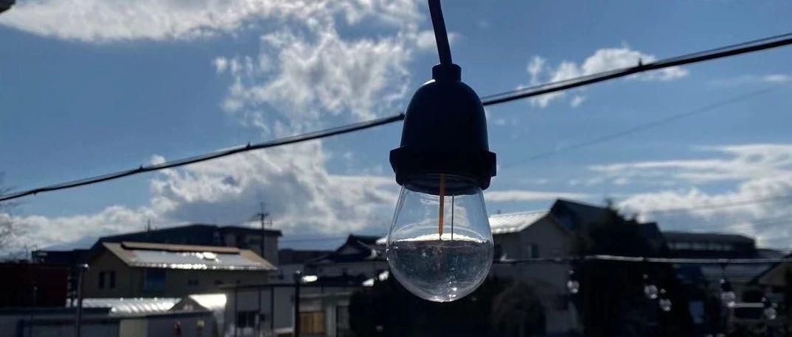

 

> 原文地址：[自我隔离的第三天](https://mp.weixin.qq.com/s/4ZcDCmXrXdEuyTDOeXTbDg)

大年初四，凌晨六点半就醒来了，然后怎么也睡不着，只觉得饿，喝了慢慢一大杯水，继续窝在被窝里，打开故事 FM ，听[「五个武汉人的封城日记」](https://mp.weixin.qq.com/s?__biz=MzI5NzY4MzkzOA==&mid=2247491284&idx=1&sn=009139fc1969c8687b39f73bc4c7050c&scene=21#wechat_redirect)，普通人的视角，没有大江大海，无比真实又让人担忧。

在电报上刷到海南医护人员支援湖北的消息，临行前与家人告别，这种独有的中国式场合，看过很多，但还是被感动到了。就当是情绪化吧，从过去的波澜不惊到如今对多了很多敏锐性，这是我自主调节的结果。

书本教化我们需要理智，用能否控制自己的情绪来衡量一个人是否成熟，可是很多时候被解读为「没有情绪波动就是成熟」，`人应当会愤怒、会感动、会伤心、会惊喜。`遇到不公义的事情，我们应该站出来；看到不合理的制度，我们要勇于革新；听到谄媚之言，我们要敢于不与之为伍。

武汉人？湖北人？先来了解下他们吧，不然没有讨论基础。

                 
> 湖北又称「千湖之省」，以在洞庭湖之北而得名。今武汉周边在西周中叶属于鄂国，湖北北部有随国、古麋国、罗国等诸侯国，春秋時期这些小国全部被楚国吞并，湖北西北部的汉水流域为楚文化的发源地，中部大部分被沼泽覆盖，是历史上著名的「云梦泽」。

> 2016 年，全省完成生产总值核实为 32297.91 亿元，排名第七，人均 GDP 为 55196 元（资料来源于湖北省统计局 2017 统计年鉴，按去年平均汇率计算，人均 GDP 为 8133 美元，中部第一）按可比价格计算，比上年增长 13.8%,连续 8 年保持两位数增长。三产 GDP 比重变化，2016 年，湖北产业结构稳步升级，全省第一、二、三产业分别完成增加值 3499.3 亿元、14375.13 亿元和 14423.48 元，分别增长 3.9%、7.8%和 9.5%。

> 武汉市，简称「汉」，别称江城，中国超大城市和国家中心城市之一，湖北省省会、副省级城市，中国中部暨长江中游地区第一大城市，**也是中部地区的政治、经济、金融、商业、物流、科技、文化、教育中心及交通、通信枢纽，**国家历史文化名城，有「九省通衢」的美誉。武汉是中国经济地理中心，中国三大「内河航运中心」之一，也是中国客运量最大的铁路枢纽和航空、公路枢纽之一。「黄金水道」长江及其最大支流汉水横贯市区，将武汉一分为三，形成了武昌、汉口、汉阳三块区域隔江鼎立的格局，史上统称之为「武汉三镇」。

> 引用自《维基百科》

武汉之于中国，如同芝加哥之于美国，这里的人民是不该被歧视的，「武昌起义」的星星火火一直都在这里蕴藏着，敢为人先的精神始终都在。

`我是一个与武汉有许多渊源的人，我珍视的家人和朋友都曾居住过此地，它也成就了众多大学学子，希望这一切尽快好起来吧，大家可以一起去过早。`

这样的日子很适合仰望，于是看了纪录片《宇宙深处高解析》，人类探索冥王星的故事，激动人心。宇宙真大啊，大到我们看不清彼此，大到我们看到的光线不过是过去星星的光辉。人这一辈子到底该怎么生活下去了呢？眼前的一切都是如此美好和珍贵，不追求永恒，但求美梦一场。

> ps 今天炖了一下午的筒骨汤 🦴，吃了两大碗米饭 🍚🍚，心情是非常棒。🤩🤩🤩