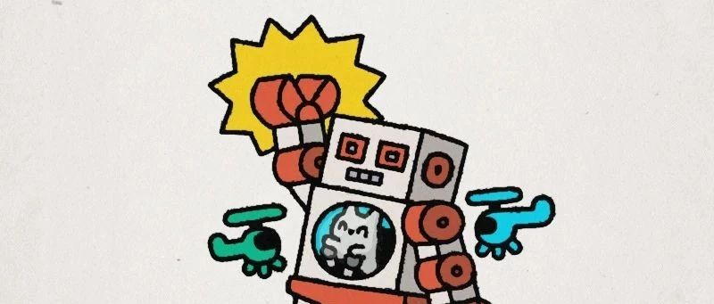
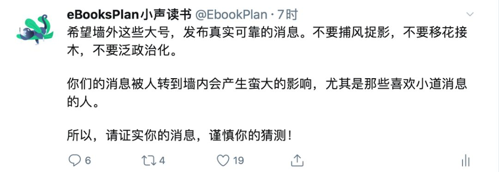

> 原文链接：[自我隔离的第 5 天](https://mp.weixin.qq.com/s/cg0wB69dcmCWkstUGQ7u5Q)

大年初五，时间滴答滴答过去，数着秒，计着分，仿佛这日子会一直这么循环下去。窗户外的架子鼓声此时显得如此重要，打破这诡异的寂静，它仿佛也懂我的意思，越加响亮和急促。声音存在着，背后的那个演奏者便存在着；写着自己的文字，我便是存在的。写作是为了什么？自媒体？从未想过成为一个媒体，我不够专业，也不够敬业。我确实想表达自己和记录世界，这是我的一点私心。

在 Twitter 上看到很多信息，大跌眼镜，套用鲁迅的话，我不惮以最坏的恶意来揣测某些人的心思。

国家治理或者有很多方案可选，但可行的方案确实不多，一味将事情泛政治化，就是又坏又蠢的做法。我曾经也是一个键盘侠，这样的功夫我都保留着，但是这是没有办法改变现实世界的。纸上得来终觉浅，绝知此事要躬行。

收到友人的消息，发觉生命终究还是脆弱的。考虑到随着年纪的增长，生命的质量会下降，时时刻刻都面临着各种不测，我们应该「自私」一点，多想想自己。相关的讨论详见 👉 [你会把生命奉献给什么？](https://mp.weixin.qq.com/s?__biz=MzI5MDM4NTYwOA==&mid=2247489397&idx=1&sn=f0f9a6aa9e4a07f81a4ef9e9c8f4687f&chksm=ec21ecd2db5665c4d18655974f21d67d437bda021ca11b46e5567aeb604738345183c8fdc830&scene=21#wechat_redirect)

这或许是场持久战吧，我是个盲目乐观的未来主义者，在那个日历上可以翻得到的那一天，我们会走出家门，摘下口罩，露出最美丽的笑容。

