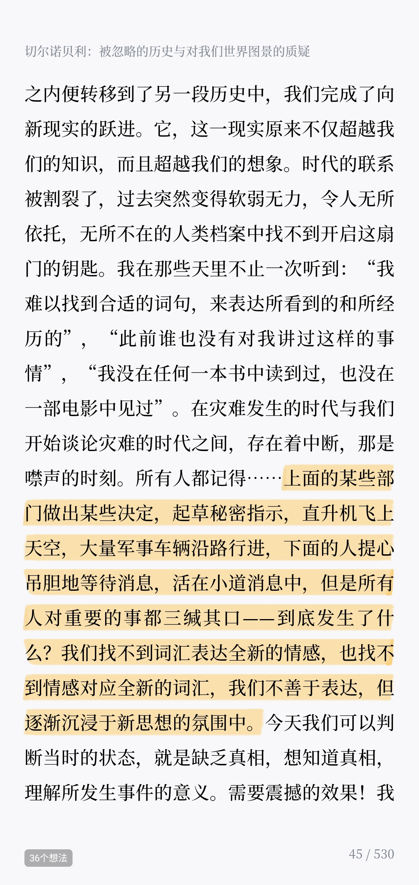

>不敢祈求所有人都幸福，只希望大家都平安

2020 年春节注定是个让人难以忘记的春节，今天是农历 2020 年大年初三，最近一个多月发生的事情或许没有人不知道，而我们在此扮演的角色，或许是亲历者，或许是目睹者，或许是旁观者…不管我们扮演着什么角色，我们都坚定的相信，我们会度过这个难关。

但得益于互联网的发达，一系列真实的，可疑的，夸大的，造谣的消息向我们扑面而来，尤其这其中的部分消息是由所谓的权威机构发布的，就如「切尔诺贝利的祭祷」中写道的：

“上面的某些部门做出某些决定，起草秘密指示，直升机飞上天空，大量军事车辆沿路行进，下面的人提心吊胆地等待消息，活在小道消息中，但是所有人对重要的事都三缄其口——到底发生了什么？我们找不到词汇表达全新的情感，也找不到情感对应全新的词汇，我们不善于表达，但逐渐沉浸于新思想的氛围中。”

基于此，我们极其需要一些相对靠谱的消息渠道，保证我们获取的信息是相对真实可靠的，就如同此次 yq 中，像腾讯官方提供的 信息较真平台[1]，就可以在一定范围内鉴别信息真假。又比如丁香医生为我们提供的 新型肺炎疫情实时动态[2]，不说里面的内容和数字绝对靠谱，但起码是经过相关靠谱平台检阅过的相对来说还算靠谱的数据和消息。

与此同时，我们也需要学会去辨别信息的真假性，而不是人云亦云，看到什么就是什么，当然，我现在也还做的不够，偶尔也会犯这种错误，有时候是看完一篇文章，觉得很有道理，顺手就给转发了，但其实文章里的内容很多是经不起推敲的，是可证伪的，只是因为作者的逻辑自洽，如同 2000 多年前的亚里士多德一样。在这个互联网高度发达的社会，信息何其多，但希望我们都能够多一些分辨信息真假的能力，多一些独立思考，多一些逻辑思维能力。

话说回到春节，本来春节应该是喜气洋洋，大家欢聚一堂的日子，今儿个去这家拜年，明儿个去另一家喝喜酒，大家其乐融融，欢声笑语，多好啊；本来年前和朋友们约好过年的时候一起爬山，一起吃饭，一起 K 歌，一起打牌，但此时此刻这些计划都只能搁置，从另一个角度想，这也给了我们一段可以好好看书，好好看电影，好好思考的时间，毕竟，这段时间，我们待在家里就是在给社会做贡献嘛。

写的有些乱，就酱，祝大家新年快乐，平安健康。

References

[1] 信息较真平台: https://vp.fact.qq.com/home?from=timeline&isappinstalled=0
[2] 新型肺炎疫情实时动态: https://3g.dxy.cn/newh5/view/pneumonia_peopleapp?from=timeline&isappinstalled=0
